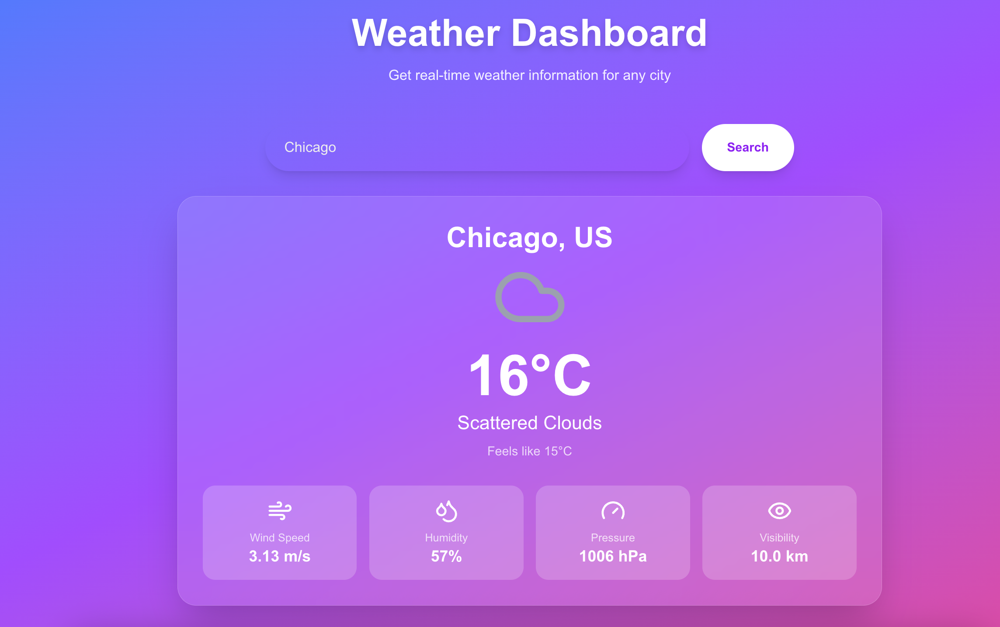

# 🌦️ Next.js Weather Dashboard

This is a simple **Next.js** application that fetches real-time **weather data** from the [OpenWeatherMap API](https://openweathermap.org/api). It allows users to search for any city and view key weather metrics such as temperature, humidity, wind speed, pressure, and visibility.

This project is also **Dockerized**, serving as a demonstration of containerizing web applications using **Docker**.


The main focus was to use AI to generate sample source-code for inital dashboard (typescript, html, tailwindcss) as the MVP, then I'd leverage the openWeather API for fetching data and returning the values to be displayed. From here, the application was able to be tested for functionality before using docker to <b>dockerize<b> the application.

---

## 🚀 Features

- 🔍 Search for real-time weather by city
- 📦 Built with [Next.js](https://nextjs.org/)
- 🌐 Fetches data from OpenWeatherMap API
- 🎨 Styled with Tailwind CSS
- 🐳 Dockerized for consistent environment setup

---

## 🛠️ Technologies Used

- **Next.js 13+**
- **React**
- **Tailwind CSS**
- **Lucide Icons**
- **OpenWeatherMap API**
- **Docker**

---

## 📸 Preview


---

#DockerFile Image Repo for reference: https://hub.docker.com/r/jjrox2167/nextjs-weather-app

##Docker pull command
docker pull jjrox2167/nextjs-weather-app

## 🔑 Setup & Installation

### 1. Clone the repository

```bash
git clone https://github.com/jjrox2167/dockerized-weatherapp.git
cd app

2. Install dependencies
npm install

3. Set up environment variables

Create a .env.local file in the root directory:

NEXT_PUBLIC_OPEN_WEATHER_API_KEY=your_openweathermap_api_key_here


💡 You can obtain a free API key from OpenWeatherMap
.

4. Run the development server
npm run dev


Then open your browser and visit http://localhost:3000

🐳 Docker Support

This project includes a Dockerfile to demonstrate how to containerize a Next.js application.

Build the Docker image:
docker build -t nextjs-weather-app .

Run the Docker container:
docker run -p 3000:3000 --env NEXT_PUBLIC_OPEN_WEATHER_API_KEY=your_api_key_here nextjs-weather-app


🌍 Your app will be available at: http://localhost:3000

✅ You can also use a .env file in Docker with --env-file if preferred.

🧪 Linting and Code Quality

Run ESLint (if configured):

npm run lint

📁 Project Structure
.
├── app/                    # Next.js app directory
├── components/            # Reusable components
├── public/                # Static assets
├── styles/                # Tailwind and global styles
├── .env.local             # Local environment variables (not committed)
├── Dockerfile             # Docker configuration
├── package.json           
└── README.md

🧠 Purpose of This Project

This project serves a dual purpose:

Frontend Practice – Building a clean, interactive dashboard with Next.js and modern UI/UX practices.

Docker Fundamentals – Showcasing how to package a full web application in a portable, reproducible containerized environment using Docker.

📜 License

This project is open-source and available under the MIT License.

.

🙋‍♂️ Author

Made by Julien Brown — @jjrox2167


